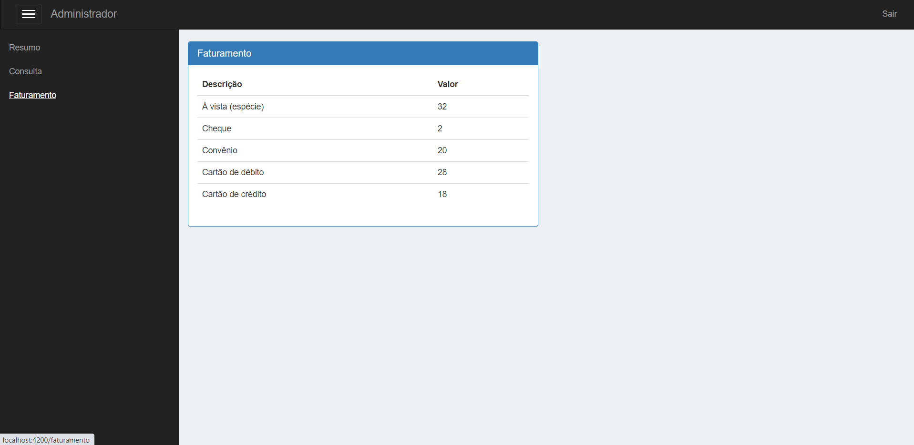

# Dashboard - Angular

## Aba: Resumo

## Aba: Consulta

## Aba: Faturamento

* 7º projeto, feito em HTML, CSS, JavaScript, TypeScript, Bootstrap e Angular.
* Projeto desenvolvido no curso de Angular da DevMedia.
* Código separado em componentes para melhor organização e utilização.
* APIs disponibilizadas pela DevMedia.
* Utilização de Rotas pra melhor experiência do usuário.